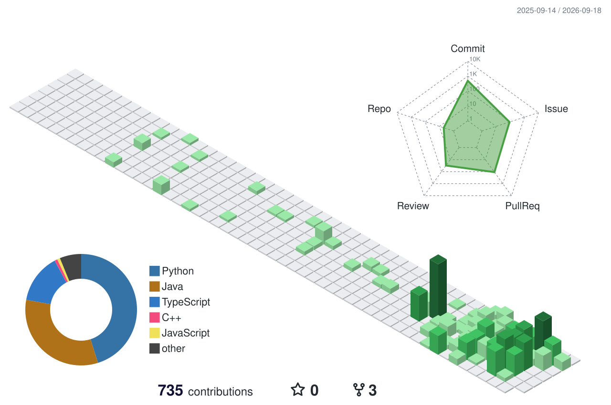

  

  

## 👀 About Me 
####  📌이름: 김민준
####  📌소속: 한국외국어대학교 글로벌캠퍼스 컴퓨터공학부
####  📌한줄 소개: 안녕하세욥
####  🔗포트폴리오: [https://nuj1min.github.io](https://nuj1min.github.io)
 
 
  
## 👉 Contact
&nbsp;&nbsp;&nbsp;&nbsp;
 
 

## 🧱 Tech Stack

### 💻 Languages
&nbsp;&nbsp;&nbsp;&nbsp;&nbsp;&nbsp;
 
 

### ⚙️ Backend & DB
&nbsp;&nbsp;&nbsp;&nbsp;&nbsp;&nbsp;&nbsp;&nbsp;&nbsp;&nbsp;&nbsp;&nbsp;&nbsp;&nbsp;
 
 

### ☁️ Infra & Core
&nbsp;&nbsp;&nbsp;&nbsp;&nbsp;&nbsp;&nbsp;&nbsp;&nbsp;&nbsp;&nbsp;&nbsp;
 
 

### 🧪 Test & Build
&nbsp;&nbsp;
 
 

## 💻 Tool
&nbsp;&nbsp;&nbsp;&nbsp;&nbsp;&nbsp;&nbsp;&nbsp;
 
 

## 🏃 Activities & Experience
* **GDG (Google Developer Groups)** | 7th Gen Member (2025.09 - 2026.08)
* **UMC (University MakeUs Challenge)** | 10th Gen Member (2026.03 - 2026.08) · 11th Gen 운영진 (2026.09 - 예정)
* **교내 보안 동아리 및 학술 소모임** | 정회원 활동 중

 

## 📜 Certifications
* **Network Administrator Level 2** (네트워크관리사 2급)
* **Linux Master Level 2** (리눅스마스터 2급)

 

## 🤔 Stats

  
  

## 🌱 3D Contribution Graph

  

